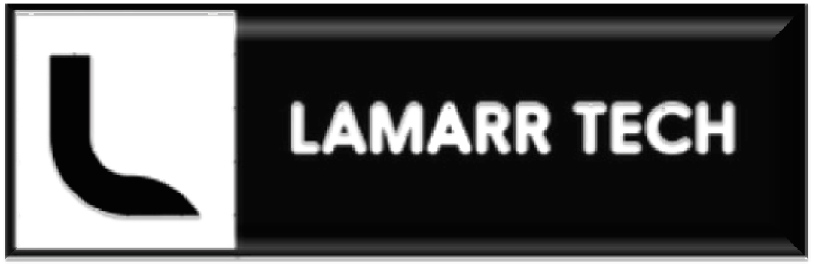
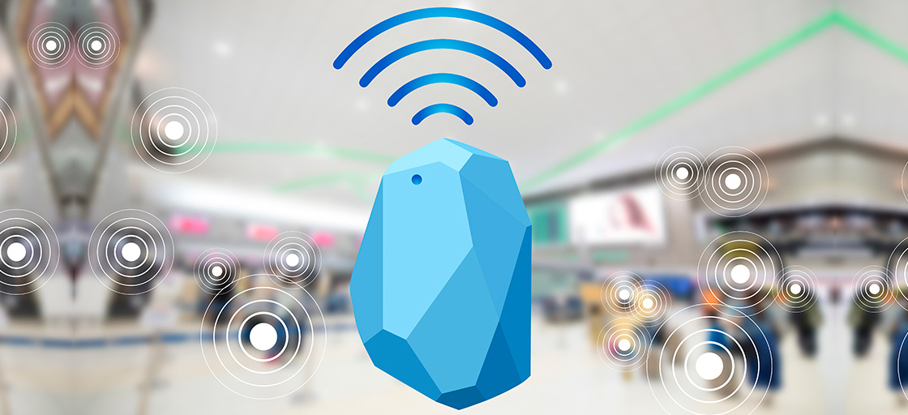

<!DOCTYPE html>
<html lang="en">
<head>
    <meta charset="UTF-8">
    <meta http-equiv="X-UA-Compatible" content="IE=edge">
    <link rel="shortcut icon" type="imagex/png" href="logojpeg.jpeg">
    <title>Lamarr Tech: Home</title>
    
</head>
<body>
    <header id="menu">
        

        

    </header>

    <main>
        <section>
            

                
            

                                

            

                <h2>Beacons o que é?</h2>
                
A tradução imediata é “farol”. E de fato, os beacons operam como um. Um beacon é um minúsculo dispositivo que emite sinais por meio de tecnologia bluetooth low energy, também conhecida como bluetooth 4.0. Os sinais podem ser captados  por aplicativos de smartphones e tablets.Além de consumir muito menos energia do dispositivo, quando comparado com o bluetooth comum, o beacon emite ondas de rádio, sendo possível uma maior penetração nas paredes de um estabelecimento. Realmente é a ferramenta ideal para locais fechados.Então, quando um cliente entra no local, consideramos o beacon como um emissor de sinais e o smartphone do consumidor como o seu receptor.

            

               
            

                <h3>Hedy Lammar</h3>  
                

Lamarr inventou o sistema que serviu de base para os telefones celulares. Durante a Segunda Guerra Mundial, criou um sofisticado aparelho de interferência em rádio para despistar radares nazistas que patenteou em 1940, usando o seu verdadeiro nome, Hedwig Eva Maria Kiesler.
                A ideia surgiu ao lado do compositor George Antheil em frente a um piano. Eles brincavam de dueto, ela repetindo em outra escala as notas que ele tocava, experimentando o controle dos instrumentos, inclusive com a música para o Ballet Mecanique, originalmente escrita para o filme abstrato de Fernand Léger, em 1924. Ou seja, duas pessoas podem conversar entre si mudando frequentemente o canal de comunicação. Basta que façam isso simultaneamente.Juntos, Antheil e Lamarr submeteram a ideia ao Departamento de Guerra norte-americano, que o recusou, em junho de 1941. Em agosto de 1942, foi patenteado por Antheil e "Hedy Kiesler Markey". A versão inicial consistia na troca de 88 frequências e era feito para despistar radares, mas a ideia pareceu difícil de realizar na época.
            

        </section>
        <footer>

            <h5>
                    Lamarr Tech 
                    CNPJ: 00.000.000/0000-00 
    
                    AFE nº 000000-1 AE nº 000000-0 
                    Certidão de Regularidade CRF/SP nº: 00000 
                    Copyright © 2022 | Todos os direitos reservados ao Lamarr Tech.
            </h5>
             
        </footer>
    </main>
</body>
</html>
